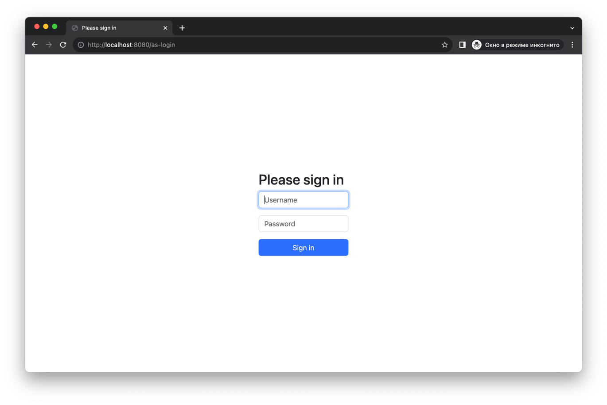
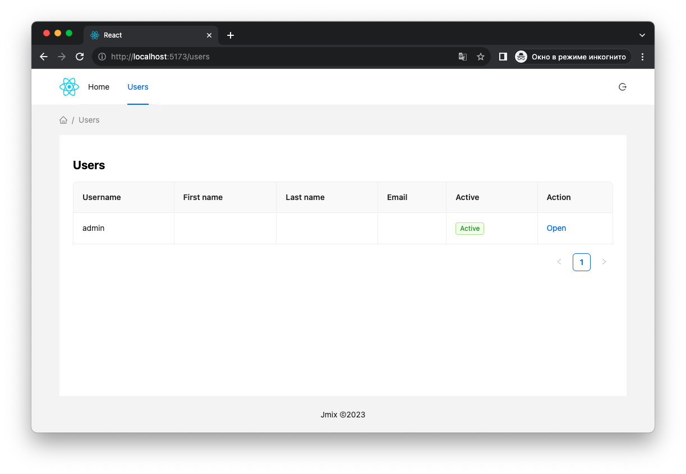

# React frontend sample

## Overview

The application demonstrates the interaction of the authentication server with a React frontend. This example uses a [Jmix](https://www.jmix.ru/) application with an [Auth Server](https://github.com/jmix-framework/jmix/tree/master/jmix-authserver) addon as a backend, and a [React](https://react.dev/) application as a frontend.

**Default credentials:**

    Username - admin
    Password - admin

## React frontend

An example of a [React](https://react.dev/) application with the [Ant.d](https://ant.design/) library. To work with oauth2, the library is used [react-oauth2-code-pkce](
https://www.npmjs.com/package/react-oauth2-code-pkce).

The main setting for oauth2 is in [main.tsx](frontend/src/main.tsx):

```ts
const authConfig: TAuthConfig = {
    clientId: 'client',
    authorizationEndpoint: 'http://localhost:8080/oauth2/authorize',
    tokenEndpoint: 'http://localhost:8080/oauth2/token',
    redirectUri: 'http://localhost:5173/',
    decodeToken: false,
    onRefreshTokenExpire: (event: TRefreshTokenExpiredEvent) => window.confirm('Session expired. Refresh page to continue using the site?') && event.login(),
}
```


**Login page:**



**Users page:**


**Start:**
```
cd frontend
npm install
npm run dev
```
Frontend available on: http://localhost:5173

## Jmix backend

Application backend created on [Jmix](https://www.jmix.ru/) with [Auth server](https://github.com/jmix-framework/jmix/blob/master/jmix-authserver) addon connected.


Basic auth server configuration, a more detailed description can be found in the [readme](https://github.com/jmix-framework/jmix/blob/master/jmix-authserver/README.md).
```
spring.security.oauth2.authorizationserver.client.myclient.registration.client-id=client
spring.security.oauth2.authorizationserver.client.myclient.registration.client-authentication_methods=none
spring.security.oauth2.authorizationserver.client.myclient.registration.authorization-grant-types=authorization_code
spring.security.oauth2.authorizationserver.client.myclient.registration.redirect-uris=http://localhost:5173/
spring.security.oauth2.authorizationserver.client.myclient.token.access-token-format=reference
spring.security.oauth2.authorizationserver.client.myclient.require-proof-key=true
```

**Start**
```
./gradlew bootRun   
```

Backend available on: http://localhost:8080